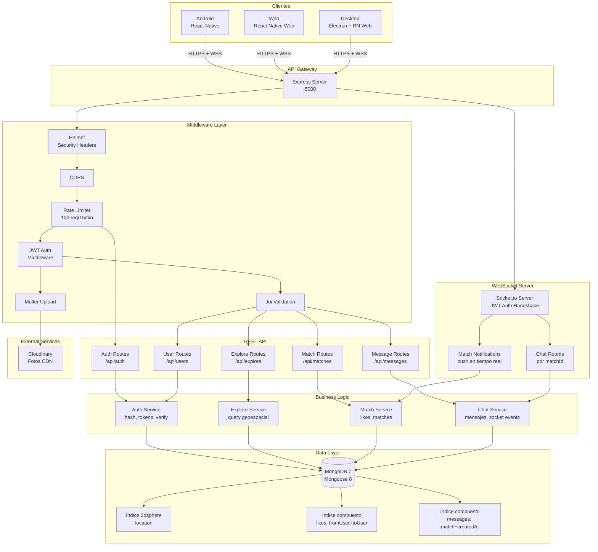
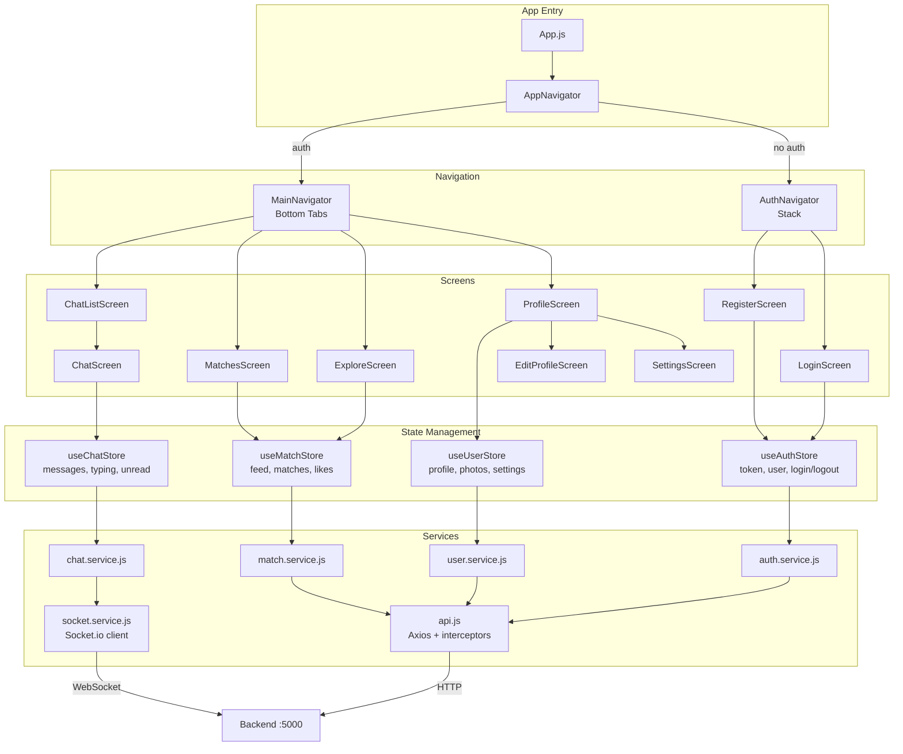
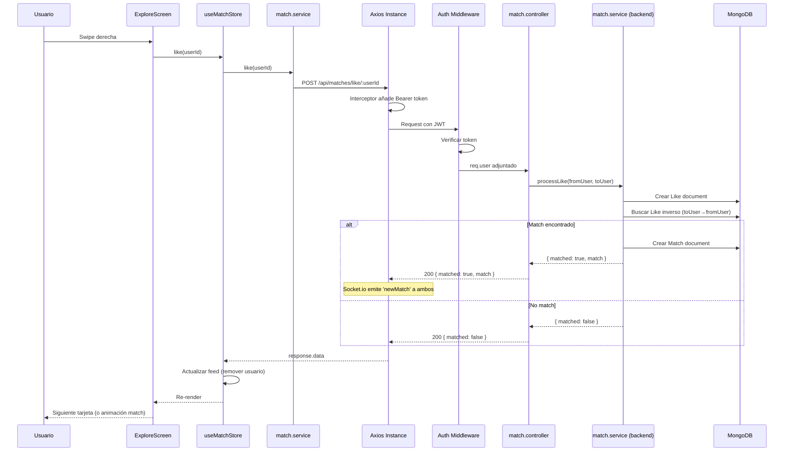
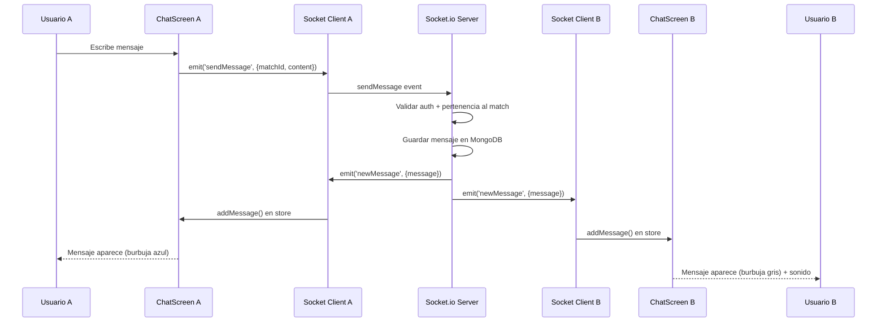

# Arquitectura del Sistema — TinderApp

## Visión General

Arquitectura cliente-servidor con API REST para operaciones CRUD y WebSocket (Socket.io) para comunicación en tiempo real. El frontend es una SPA multiplataforma con React Native.

---

## Diagrama de Arquitectura General

---

## Diagrama de Componentes del Frontend

---

## Flujo de Datos

### Request HTTP (ejemplo: dar Like)

### WebSocket (Chat en tiempo real)

---

## Patrones de Diseño Utilizados

| Patrón | Dónde | Propósito |
|--------|-------|-----------|
| **Repository** | Services (backend) | Abstracción de acceso a datos |
| **Middleware Chain** | Express middleware | Procesamiento pipeline de requests |
| **Observer** | Socket.io events | Notificaciones en tiempo real |
| **Singleton** | Socket client (frontend) | Una conexión WebSocket por app |
| **Store** | Zustand stores | Estado centralizado por dominio |
| **Interceptor** | Axios interceptors | Auth automática y refresh tokens |
| **Strategy** | Validators (Joi schemas) | Validación declarativa intercambiable |

---

## Decisiones de Arquitectura

### ¿Por qué MongoDB y no PostgreSQL?
- Datos de perfil semi-estructurados (fotos, intereses, settings varían)
- Soporte nativo de índices geoespaciales (`2dsphere`) para queries de proximidad
- Esquemas flexibles con Mongoose para evolución rápida
- Mejor fit para el patrón de acceso (lectura frecuente de perfiles completos)

### ¿Por qué Socket.io y no WebSocket nativo?
- Rooms nativas (una por match = un chat room)
- Reconnect automático con backoff exponencial
- Fallback a long-polling si WebSocket no está disponible
- Middleware de autenticación integrado
- Broadcasting a rooms simplifica el chat

### ¿Por qué Zustand y no Redux?
- Mucho menos boilerplate
- No necesita providers ni wrappers
- API simple con hooks nativos
- Suficiente para el tamaño de esta app
- Suscripción selectiva a slices de estado

### ¿Por qué Cloudinary y no almacenamiento propio?
- CDN global incluido
- Transformaciones de imagen on-the-fly (resize, crop, optimización)
- No gestionar almacenamiento propio
- Free tier generoso (25 créditos/mes)
