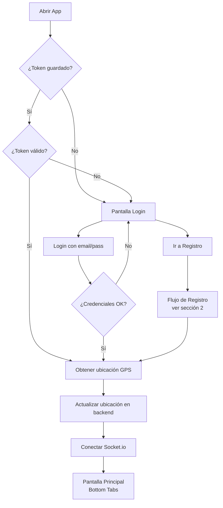
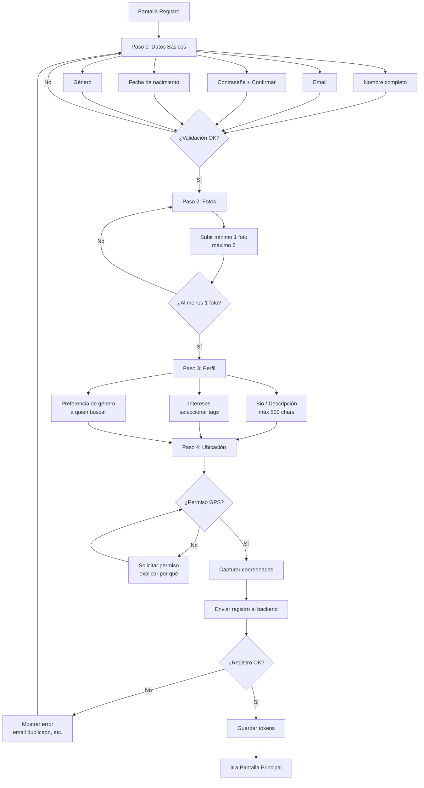
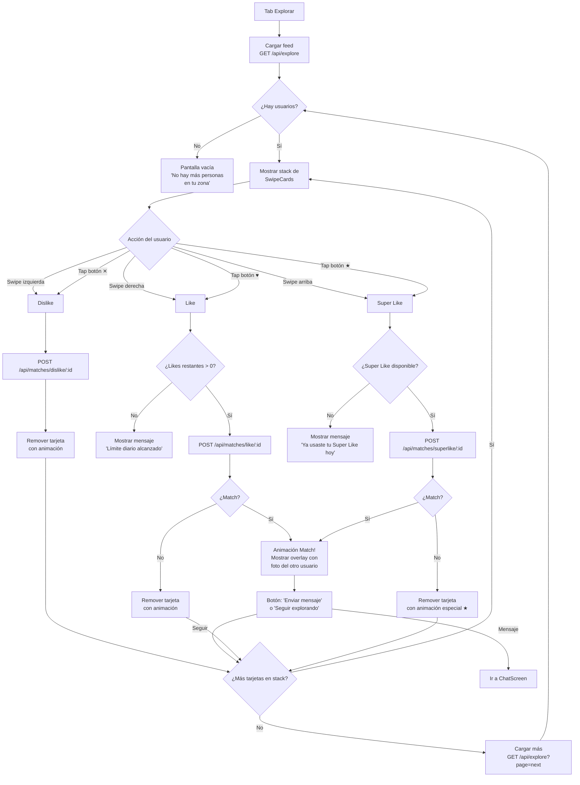
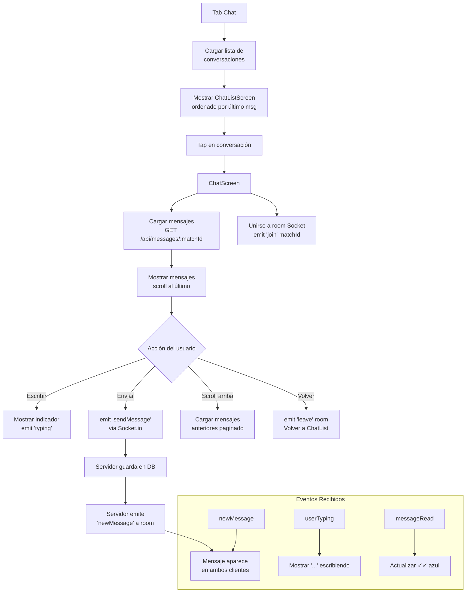
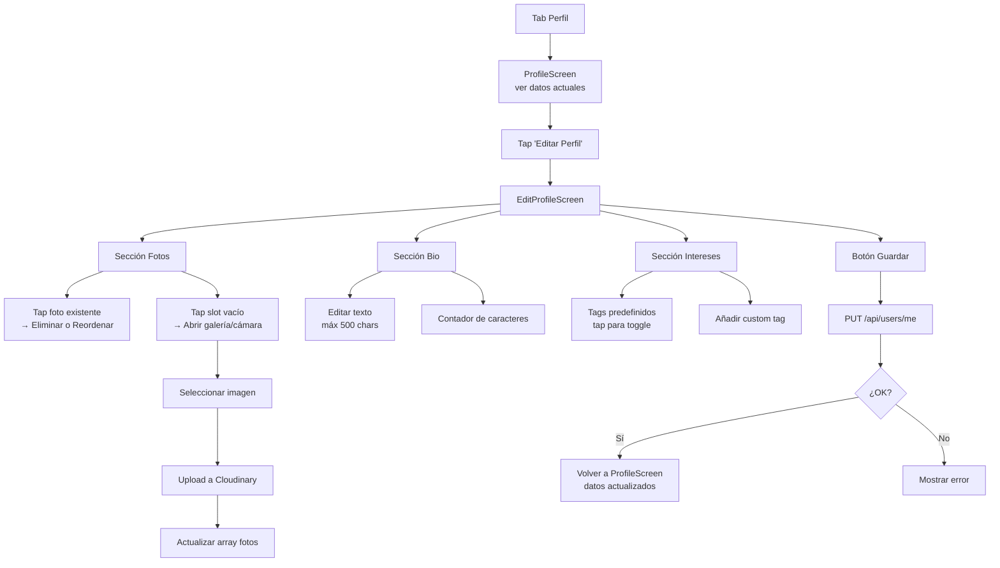
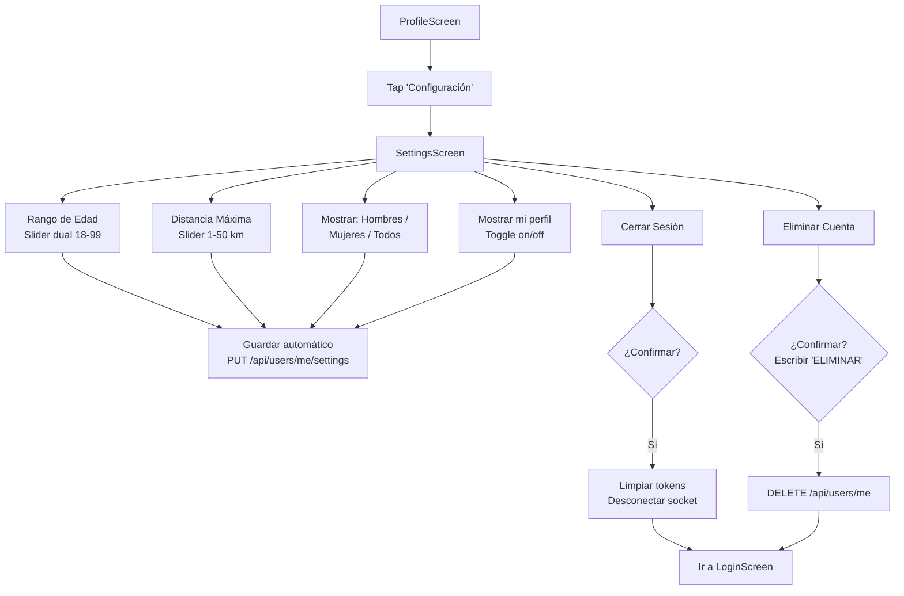
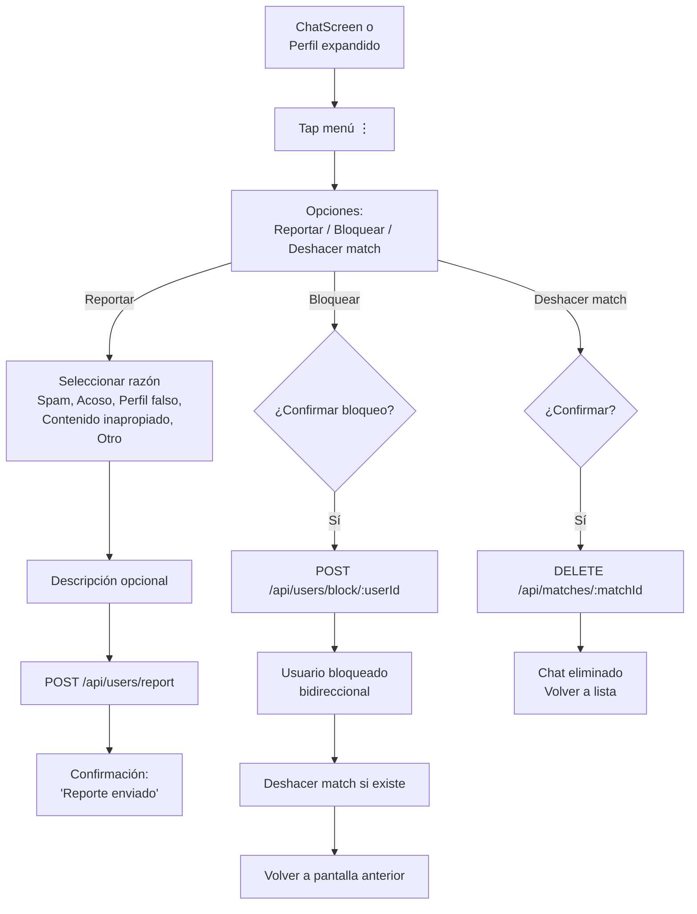
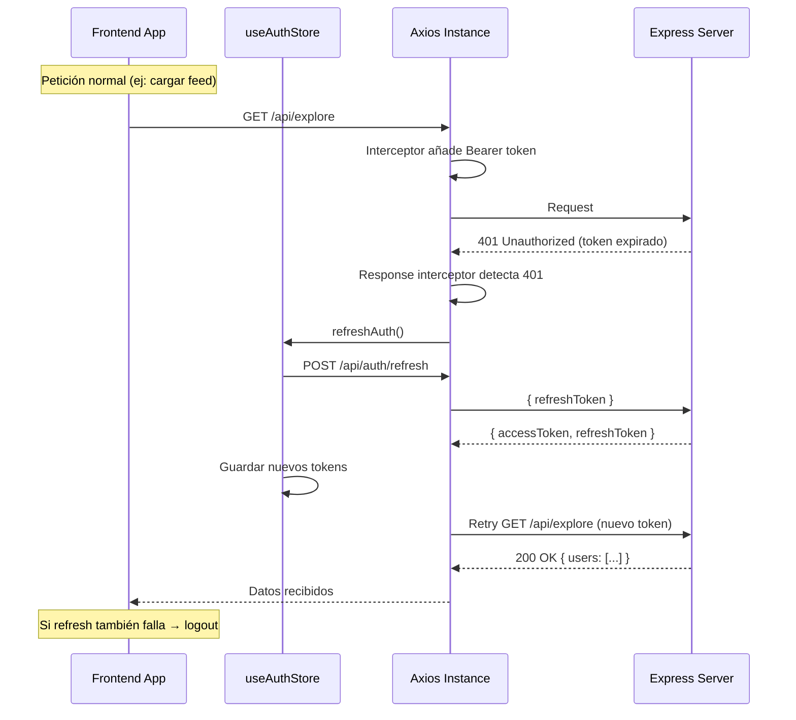

# Flujos de Usuario — TinderApp

## 1. Flujo Principal (Overview)

---

## 2. Flujo de Registro

### Validaciones del Registro
| Campo | Regla | Mensaje de error |
|-------|-------|-----------------|
| Nombre | 2-50 caracteres, solo letras y espacios | "Nombre debe tener entre 2 y 50 caracteres" |
| Email | Formato email válido | "Email no válido" |
| Contraseña | Mínimo 6 caracteres, al menos 1 número | "Contraseña debe tener al menos 6 caracteres y 1 número" |
| Confirmar | Debe coincidir con contraseña | "Las contraseñas no coinciden" |
| Fecha nacimiento | Edad ≥ 18 años | "Debes ser mayor de 18 años" |
| Género | Obligatorio (hombre/mujer/otro) | "Selecciona tu género" |
| Foto | Mínimo 1, máx 5MB, JPG/PNG/WebP | "Sube al menos una foto" |

---

## 3. Flujo de Exploración (Swipe)

### Detalles de la Tarjeta Expandida
- Tap en la tarjeta → se expande a pantalla completa
- Muestra: todas las fotos (swipeable), nombre, edad, distancia, bio completa, intereses
- Botones de acción (like/dislike/superlike) disponibles también en vista expandida
- Swipe down o botón X para cerrar

---

## 4. Flujo de Chat

### Estados de Mensajes
| Estado | Indicador | Descripción |
|--------|-----------|-------------|
| Enviando | ○ (reloj) | Mensaje en tránsito |
| Enviado | ✓ | Guardado en servidor |
| Leído | ✓✓ | Destinatario abrió el chat |

---

## 5. Flujo de Edición de Perfil

---

## 6. Flujo de Configuración

---

## 7. Flujo de Reportar / Bloquear

---

## 8. Flujo de Autenticación (Token Refresh)

