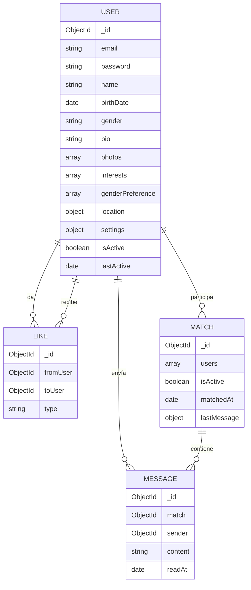

# Modelos de Datos — TinderApp

Esquemas MongoDB con Mongoose 8. Todos los modelos incluyen timestamps automáticos (`createdAt`, `updatedAt`).

---

## User

Modelo principal. Combina datos de autenticación, perfil y configuración.

```javascript
const userSchema = new Schema({
  // === AUTENTICACIÓN ===
  email: {
    type: String,
    required: true,
    unique: true,
    lowercase: true,
    trim: true,
    match: /^[\w-\.]+@([\w-]+\.)+[\w-]{2,4}$/
  },
  password: {
    type: String,
    required: true,
    minlength: 6,
    select: false  // No incluir en queries por defecto
  },
  refreshToken: {
    type: String,
    select: false
  },

  // === PERFIL ===
  name: {
    type: String,
    required: true,
    trim: true,
    minlength: 2,
    maxlength: 50
  },
  birthDate: {
    type: Date,
    required: true,
    validate: {
      validator: function(date) {
        // Debe ser mayor de 18 años
        const age = Math.floor((Date.now() - date.getTime()) / (365.25 * 24 * 60 * 60 * 1000));
        return age >= 18;
      },
      message: 'Debes ser mayor de 18 años'
    }
  },
  gender: {
    type: String,
    required: true,
    enum: ['hombre', 'mujer', 'otro']
  },
  bio: {
    type: String,
    maxlength: 500,
    default: ''
  },
  photos: [{
    url: { type: String, required: true },         // URL de Cloudinary
    publicId: { type: String, required: true },     // ID para eliminar de Cloudinary
    order: { type: Number, required: true }          // Orden de visualización (0 = principal)
  }],
  interests: [{
    type: String,
    trim: true,
    maxlength: 30
  }],

  // === PREFERENCIAS DE BÚSQUEDA ===
  genderPreference: [{
    type: String,
    enum: ['hombre', 'mujer', 'otro']
  }],

  // === UBICACIÓN (GeoJSON) ===
  location: {
    type: {
      type: String,
      enum: ['Point'],
      default: 'Point'
    },
    coordinates: {
      type: [Number],  // [longitud, latitud]
      default: [0, 0]
    }
  },

  // === CONFIGURACIÓN ===
  settings: {
    maxDistance: {
      type: Number,
      default: 10,       // km
      min: 1,
      max: 50
    },
    ageRange: {
      min: { type: Number, default: 18, min: 18, max: 99 },
      max: { type: Number, default: 35, min: 18, max: 99 }
    },
    showMe: {
      type: Boolean,
      default: true     // Visible en exploración
    }
  },

  // === ESTADO ===
  isActive: {
    type: Boolean,
    default: true
  },
  isVerified: {
    type: Boolean,
    default: false
  },
  lastActive: {
    type: Date,
    default: Date.now
  },
  blockedUsers: [{
    type: Schema.Types.ObjectId,
    ref: 'User'
  }]
}, {
  timestamps: true
});
```

### Índices del User

```javascript
// Índice geoespacial para queries de proximidad
userSchema.index({ location: '2dsphere' });

// Índice para búsqueda por email (login)
userSchema.index({ email: 1 }, { unique: true });

// Índice para filtrar usuarios activos + visibles
userSchema.index({ isActive: 1, 'settings.showMe': 1 });

// Índice para última actividad (ocultar inactivos)
userSchema.index({ lastActive: 1 });
```

### Hooks del User

```javascript
// Pre-save: hashear contraseña si fue modificada
userSchema.pre('save', async function(next) {
  if (!this.isModified('password')) return next();
  this.password = await bcrypt.hash(this.password, 12);
  next();
});

// Método de instancia: comparar contraseña
userSchema.methods.comparePassword = async function(candidatePassword) {
  return bcrypt.compare(candidatePassword, this.password);
};

// Método de instancia: calcular edad
userSchema.methods.getAge = function() {
  return Math.floor((Date.now() - this.birthDate.getTime()) / (365.25 * 24 * 60 * 60 * 1000));
};

// Virtual: edad (no se guarda en DB)
userSchema.virtual('age').get(function() {
  return this.getAge();
});

// toJSON: excluir campos sensibles
userSchema.set('toJSON', {
  virtuals: true,
  transform: function(doc, ret) {
    delete ret.password;
    delete ret.refreshToken;
    delete ret.__v;
    return ret;
  }
});
```

---

## Like

Registra cada acción de like/dislike/superlike. Índice compuesto evita duplicados.

```javascript
const likeSchema = new Schema({
  fromUser: {
    type: Schema.Types.ObjectId,
    ref: 'User',
    required: true
  },
  toUser: {
    type: Schema.Types.ObjectId,
    ref: 'User',
    required: true
  },
  type: {
    type: String,
    enum: ['like', 'dislike', 'superlike'],
    required: true
  }
}, {
  timestamps: true
});
```

### Índices del Like

```javascript
// Único: un usuario solo puede hacer una acción sobre otro
likeSchema.index({ fromUser: 1, toUser: 1 }, { unique: true });

// Para buscar quién le dio like a un usuario (check de match)
likeSchema.index({ toUser: 1, type: 1 });

// Para obtener la lista de usuarios ya vistos por un usuario
likeSchema.index({ fromUser: 1 });
```

### Lógica de Match

```javascript
// Después de crear un Like de tipo 'like' o 'superlike':
// 1. Buscar si existe un Like inverso (toUser → fromUser) con type 'like' o 'superlike'
// 2. Si existe → crear Match entre ambos usuarios
// 3. Emitir evento 'newMatch' via Socket.io a ambos usuarios

async function processLike(fromUserId, toUserId, type) {
  // Crear el like
  const like = await Like.create({ fromUser: fromUserId, toUser: toUserId, type });

  if (type === 'dislike') return { matched: false };

  // Buscar like inverso
  const inverseLike = await Like.findOne({
    fromUser: toUserId,
    toUser: fromUserId,
    type: { $in: ['like', 'superlike'] }
  });

  if (inverseLike) {
    // ¡Match! Crear match con IDs ordenados para evitar duplicados
    const sortedUsers = [fromUserId, toUserId].sort();
    const match = await Match.create({
      users: sortedUsers,
      matchedAt: new Date()
    });
    return { matched: true, match };
  }

  return { matched: false };
}
```

---

## Match

Representa una coincidencia mutua entre dos usuarios. Habilita el chat.

```javascript
const matchSchema = new Schema({
  users: [{
    type: Schema.Types.ObjectId,
    ref: 'User',
    required: true
  }],
  isActive: {
    type: Boolean,
    default: true
  },
  matchedAt: {
    type: Date,
    default: Date.now
  },
  lastMessage: {
    content: String,
    sender: { type: Schema.Types.ObjectId, ref: 'User' },
    sentAt: Date
  }
}, {
  timestamps: true
});
```

### Índices del Match

```javascript
// Para buscar matches de un usuario específico
matchSchema.index({ users: 1, isActive: 1 });

// Para ordenar por última actividad (último mensaje)
matchSchema.index({ 'lastMessage.sentAt': -1 });

// Único: evitar match duplicado entre los mismos usuarios
// Se usa con users ordenados por ID
matchSchema.index({ users: 1 }, { unique: true });
```

### Notas
- `users` siempre se guarda con los IDs ordenados (menor primero) para garantizar unicidad
- `lastMessage` es un subdocumento desnormalizado para listar conversaciones sin join
- Cuando un usuario deshace un match, `isActive` pasa a `false`

---

## Message

Mensajes de chat entre usuarios con match activo.

```javascript
const messageSchema = new Schema({
  match: {
    type: Schema.Types.ObjectId,
    ref: 'Match',
    required: true
  },
  sender: {
    type: Schema.Types.ObjectId,
    ref: 'User',
    required: true
  },
  content: {
    type: String,
    required: true,
    maxlength: 1000,
    trim: true
  },
  readAt: {
    type: Date,
    default: null
  }
}, {
  timestamps: true  // createdAt = fecha de envío
});
```

### Índices del Message

```javascript
// Para cargar mensajes de un chat, ordenados cronológicamente
messageSchema.index({ match: 1, createdAt: -1 });

// Para contar mensajes no leídos por match
messageSchema.index({ match: 1, sender: 1, readAt: 1 });
```

---

## Relaciones entre Modelos



---

## Datos de Ejemplo (Seed)

```javascript
// Usuario de ejemplo para seed/testing
const sampleUser = {
  email: 'ana@example.com',
  password: 'test123',  // Se hasheará automáticamente
  name: 'Ana García',
  birthDate: new Date('1998-05-15'),
  gender: 'mujer',
  bio: 'Amante de los viajes y la fotografía 📸',
  photos: [{
    url: 'https://res.cloudinary.com/demo/image/upload/v1/tinderapp/ana1.jpg',
    publicId: 'tinderapp/ana1',
    order: 0
  }],
  interests: ['viajes', 'fotografía', 'cocina', 'senderismo'],
  genderPreference: ['hombre'],
  location: {
    type: 'Point',
    coordinates: [-3.7038, 40.4168]  // Madrid centro
  },
  settings: {
    maxDistance: 15,
    ageRange: { min: 25, max: 35 },
    showMe: true
  }
};
```
